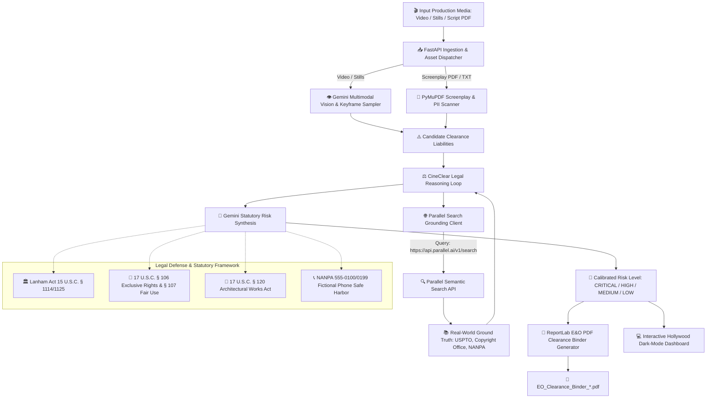

# CineClear AI - Application Architecture Map (APP_MAP.md)

This document provides the definitive architectural map and component directory of the **CineClear AI Legal & E&O Clearance System**.

---

## 1. System Overview



---

## 2. API Endpoint Directory

| Method | Endpoint | Handler Function | Purpose / Description |
| :--- | :--- | :--- | :--- |
| **GET** | `/` | `serve_dashboard` | Serves the interactive Hollywood studio dark-mode web dashboard. |
| **GET** | `/health` | `health_check` | Service health status, active API key status, model configuration, and environment check. |
| **GET** | `/api/samples` | `list_sample_media` | Returns pre-loaded Hollywood test assets (set photos, screenplay PDF, scene text) for instant 1-click evaluation. |
| **POST** | `/api/audit` | `audit_media_endpoint` | Primary analysis endpoint. Ingests uploaded footage, set photo, or sample ID; executes multimodal vision and Parallel search grounding; returns `ClearanceAuditReport`. |
| **GET** | `/api/reports/{report_id}` | `get_report_json` | Retrieves cached JSON audit report containing all itemized flags, risk tallies, and search grounding metadata. |
| **GET** | `/api/reports/{report_id}/pdf` | `download_report_pdf` | Serves the generated Hollywood-grade ReportLab E&O Clearance Binder PDF with headers, ledgers, and sign-off blocks. |
| **GET** | `/static/*` | StaticFiles Mount | Serves client CSS, JavaScript, and UI assets. |

---

## 3. Data Model & Schema Definitions

### Legal Clearance Schemas (`app/models.py`)

```python
class RiskLevel(str, Enum):
    LOW = "LOW"            # Fair use / de minimis / public domain
    MEDIUM = "MEDIUM"      # Incidental mark / ambiguous rights / verify release
    HIGH = "HIGH"          # Explicit trademark, uncleared music, modern art
    CRITICAL = "CRITICAL"  # Defamatory placement, living person likeness risk, real PII

class ClearanceCategory(str, Enum):
    TRADEMARK_LOGO = "TRADEMARK_LOGO"
    COPYRIGHTED_ART = "COPYRIGHTED_ART"
    ARCHITECTURAL_RIGHTS = "ARCHITECTURAL_RIGHTS"
    MUSIC_AUDIO = "MUSIC_AUDIO"
    NAME_DEFAMATION = "NAME_DEFAMATION"
    PHONE_PII = "PHONE_PII"

class ParallelVerification(BaseModel):
    search_objective: str
    sources_checked: List[str]
    is_public_domain: bool = False
    active_trademark_found: bool = False
    rights_holder_identified: Optional[str] = None
    statutory_context: str

class ClearanceFlag(BaseModel):
    id: str
    timestamp_or_page: str
    category: ClearanceCategory
    detected_entity: str
    visual_description: str
    risk_level: RiskLevel
    verification: ParallelVerification
    mitigation_action: str

class ClearanceAuditReport(BaseModel):
    id: str
    project_title: str
    media_filename: str
    media_type: str
    total_flags: int
    critical_count: int
    high_count: int
    medium_count: int
    low_count: int
    flags: List[ClearanceFlag]
    generated_at: str
    pdf_report_path: Optional[str] = None
```

---

## 4. Storage & Persistence Mapping

```text
C:\Users\adamm_000\Desktop\CineClearAi\
├── .env.example                     # Environment template (Gemini & Parallel keys, server port)
├── .env                             # Local environment configuration
├── .gitignore                       # Standard Python / artifact ignore rules
├── requirements.txt                 # Project dependencies
├── README.md                        # Primary documentation & build guide
├── STATE.md                         # Operational state, component health & runbook
├── APP_MAP.md                       # Application architectural map & schemas
├── SPINE.md                         # Core system invariants & clearance lifecycles
├── generate_sample_media.py         # Test asset generator for stills and screenplays
├── main.py                          # Terminal CLI & batch analysis engine
├── server.py                        # FastAPI web server (port 8085)
├── run.bat                          # Local one-click server & browser launcher
├── app/
│   ├── __init__.py
│   ├── config.py                    # Pydantic Settings & environment manager
│   ├── models.py                    # Pydantic legal clearance schemas
│   ├── parallel_client.py           # Parallel Search API client with live search & mock engine
│   ├── vision_agent.py              # Gemini Multimodal visual & audio parser
│   ├── auditor.py                   # Multi-turn clearance reasoning & verification loop
│   └── report_generator.py          # ReportLab PDF E&O Clearance Binder generator
├── static/
│   ├── index.html                   # Cinematic dark-mode studio dashboard
│   ├── style.css                    # Production styling & risk color variables
│   └── app.js                       # Interactive UI controller & async pipeline client
├── sample_media/
│   ├── sample_set_photo.jpg         # Sample production still (wardrobe logos, set art)
│   ├── sample_screenplay.pdf        # Screenplay PDF with PII/phone & brand mentions
│   └── sample_screenplay.txt        # Screenplay scene text
├── uploads/                         # Temporary storage for uploaded footage & scripts
├── reports/                         # Generated E&O Insurance PDF Clearance Binders
└── tests/                           # Automated test suite
    ├── __init__.py
    ├── test_models.py               # Schema & validation tests
    ├── test_parallel_client.py      # Parallel search client tests
    ├── test_auditor.py              # Clearance audit & reasoning tests
    └── test_server.py               # FastAPI endpoint tests
```

---

## 5. Security, Grounding & Legal Defense Architecture

1. **Grounded Legal Chain of Custody:**
   * Every clearance flag maintains an immutable `ParallelVerification` payload recording the exact search objective query, sources examined, rights holder identified, and statutory context.
2. **Statutory Safe Harbor Verification:**
   * Automatically cross-references architectural landmarks against **17 U.S.C. § 120(a)** (AWCPA) to avoid unnecessary licensing costs for public buildings.
   * Enforces **NANPA 555-0100 through 555-0199** reservation range to eliminate civil privacy liability.
3. **De-biasing & Deterministic Fallback:**
   * If third-party APIs experience rate limits or network degradation, the auditor gracefully utilizes an offline verified knowledge database without crashing or returning ungrounded hallucinations.
4. **Court-Ready E&O Binder Deliverables:**
   * PDF output adheres to entertainment insurance underwriting specifications, including clear executive summaries, risk matrices, itemized ledgers, and attorney/underwriter signature certification blocks.
