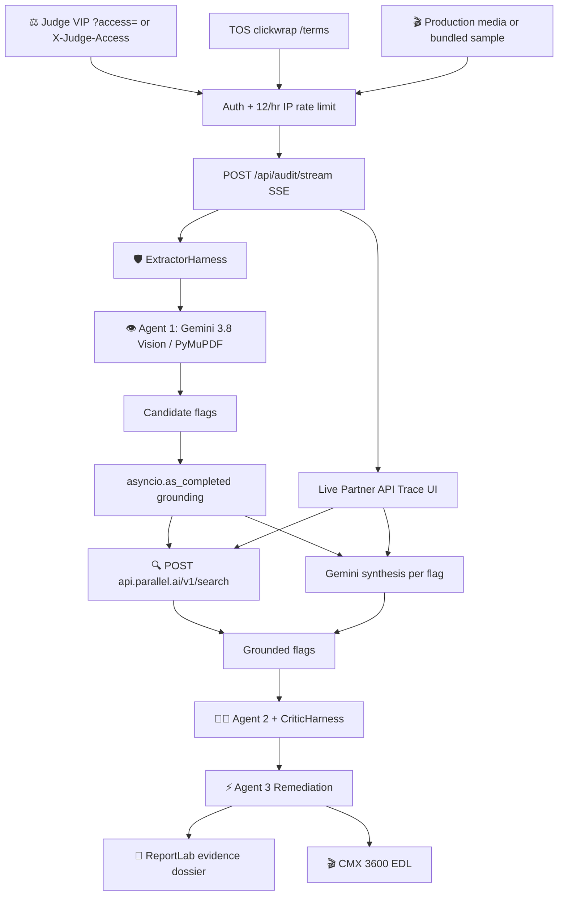

# CineClear AI - Application Architecture Map (APP_MAP.md)

Definitive architectural map of the **CineClear AI cinema legal & E&O research system** (decision-support for licensed production counsel — not a clearance certificate).

**Last aligned:** September 6, 2026

---

## 1. System Overview & 3-Agent Triad



---

## 2. API Endpoint Directory

| Method | Endpoint | Handler | Auth | Purpose |
| :--- | :--- | :--- | :--- | :--- |
| **GET** | `/` | `serve_dashboard` | Public | Cinema dark-mode dashboard (`Cache-Control: no-store` on HTML/JS/CSS). |
| **GET** | `/health` | `health_check` | Public | Keys configured, model, `tos_version`, `decision_support_only`. |
| **GET** | `/terms` `/legal` | `serve_terms` | Public | TOS / EULA (AS-IS, LoL, indemnification, UPL). |
| **GET** | `/favicon.ico` | `favicon` | Public | Tab icon. |
| **GET** | `/api/samples` | `list_sample_media` | Public | Metadata for 4K still, PDF script, TXT scene. |
| **GET** | `/api/auth/verify` | `verify_judge_auth` | Optional header/query | `VIP_JUDGE` vs `PUBLIC_GUEST`. |
| **POST** | `/api/audit` | `audit_media_endpoint` | **Judge VIP** | JSON audit (tests/CLI). Purges `uploads/` after. |
| **POST** | `/api/audit/stream` | `audit_media_stream_endpoint` | **Judge VIP** | SSE: `stage`, `log` (Gemini/Parallel), `complete`. |
| **GET** | `/api/reports/{id}` | `get_report_json` | Public* | In-memory report cache (single instance). |
| **GET** | `/api/reports/{id}/pdf` | `download_report_pdf` | Public* | Regenerates PDF if missing on disk. |
| **GET** | `/api/reports/{id}/edl` | `download_edl_markers` | Public* | CMX 3600 from cached report. |
| **POST** | `/api/export/pdf` | `export_pdf_from_report` | Public* | Rebuild PDF from **client report JSON** (Cloud Run safe). |
| **POST** | `/api/export/edl` | `export_edl_from_report` | Public* | Rebuild EDL from client report JSON. |
| **GET** | `/static/*` | StaticFiles | Public | `index.html`, `app.js`, `style.css`, favicons, `legal.html`. |
| **GET** | `/sample_media/*` | StaticFiles | Public | Bundled still/PDF/TXT (not confidential). |

\*Report GET/export do not re-call Gemini. Live partner spend is only on `/api/audit*`.

Judge header: `X-Judge-Access: cineclear-judge-2026` or query `?access=` (dashboard). Production env: `REQUIRE_JUDGE_AUTH_FOR_UPLOADS=true` applies to **samples and uploads**.

---

## 3. Data Model (`app/models.py`)

Core types: `RiskLevel`, `ClearanceCategory`, `ParallelVerification`, `ClearanceFlag` (plus `box_2d`, `fair_use_scorecard`, `territory_matrix`, `arch_assessment`, `rogers_assessment`), `RemediationPackage`, `ClearanceAuditReport` (`legal_disclaimer` defaults to `UPL_LEGAL_DISCLAIMER`).

`TOS_VERSION = "2026-09-06"`. UPL text states decision-support only, AS-IS, not a clearance or insurance certificate.

---

## 4. Storage & Module Map

```text
CineClearAi/
├── server.py                 # FastAPI: auth, SSE, export, TOS, favicon, rate limit
├── main.py                   # CLI batch auditor
├── generate_sample_media.py  # ensure_sample_media() for still/PDF/TXT
├── deploy_cloudrun.ps1       # Production Cloud Run
├── static/index.html|app.js|style.css|legal.html|favicon.*
├── app/
│   ├── config.py             # Gemini 3.8, Parallel, JUDGE_ACCESS_KEY, auth flag
│   ├── models.py             # Schemas + UPL + TOS_VERSION
│   ├── telemetry.py          # ContextVar sink → SSE `log` events
│   ├── retention.py          # Purge uploads/ only
│   ├── gemini_cascade.py     # 2-tier live failover + judge logs
│   ├── parallel_client.py    # Live POST /search + judge logs
│   ├── vision_agent.py       # Agent 1
│   ├── auditor.py            # Orchestration + concurrent grounding
│   ├── harness.py            # ExtractorHarness / CriticHarness
│   ├── fair_use_analyzer.py
│   ├── music_arch_analyzer.py
│   ├── remediation_agent.py  # Agent 3
│   ├── report_generator.py   # Evidence dossier PDF
│   └── edl_exporter.py       # CMX 3600 + decision-support comments
├── sample_media/             # Bundled judge assets (PDF regenerated if missing)
├── uploads/                  # Ephemeral; purged after audit
├── reports/                  # Generated PDFs (gitignore)
└── tests/                    # 11 modules including test_retention, stream, TOS
```

---

## 5. Security, Grounding & Legal Defense

1. **Partner chain of custody:** Each flag stores Parallel `search_objective`, source URLs, holder, statute. Judge UI prints live HTTP to Gemini `generateContent` and `api.parallel.ai/v1/search`.
2. **Quota:** Judge VIP required; 12 audits/hour/IP; cascade depth 2; uploads deleted after run.
3. **Harnesses:** Extractor dedupe; Critic blocks modern TM as public domain; phones CRITICAL.
4. **UPL:** Dashboard, PDF footers, EDL comments, and `/terms` say counsel-review dossier — licensed attorney/broker sign-off is the only legally operative act.
5. **Exports:** Prefer `POST /api/export/*` with the report body so a second Cloud Run replica can still download.
