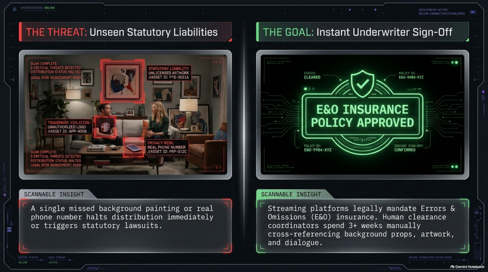
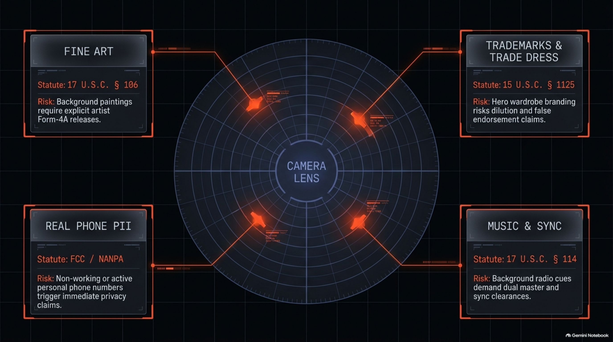
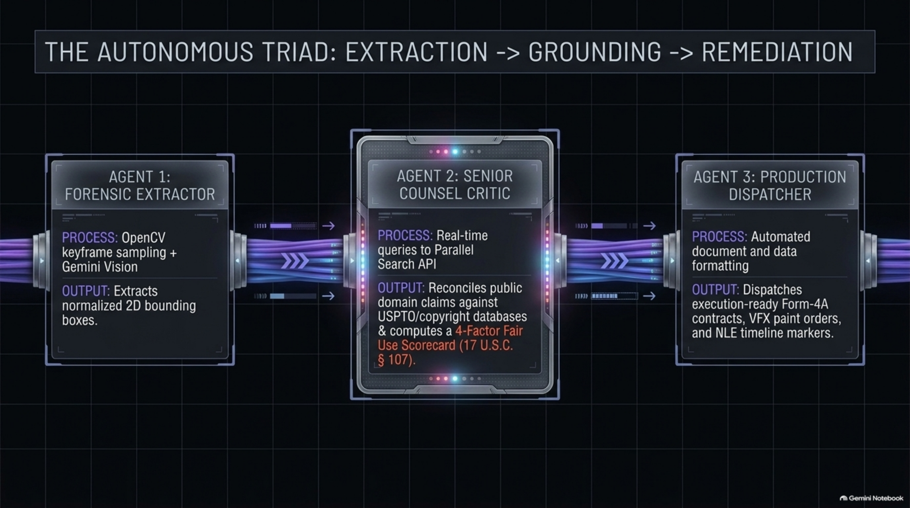
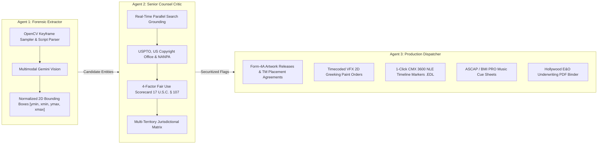
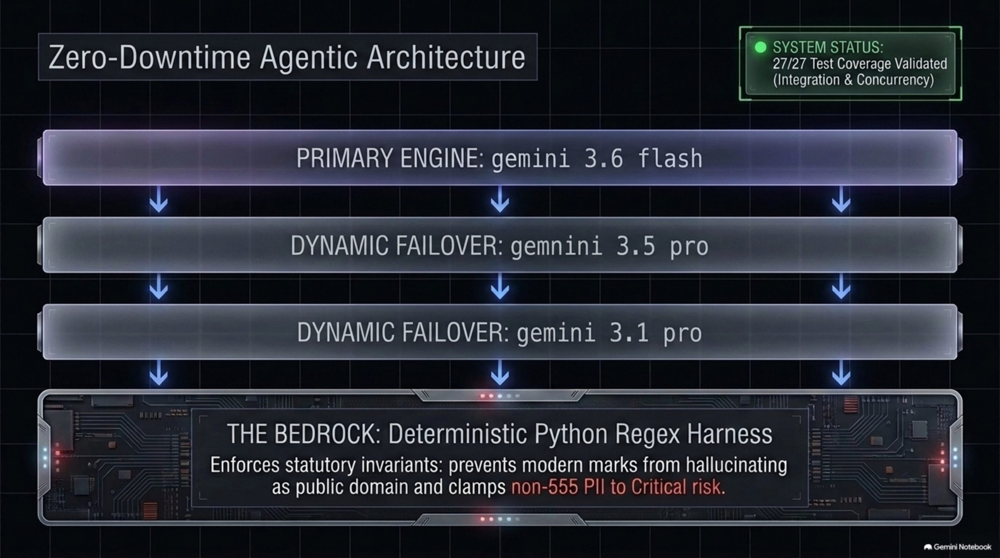
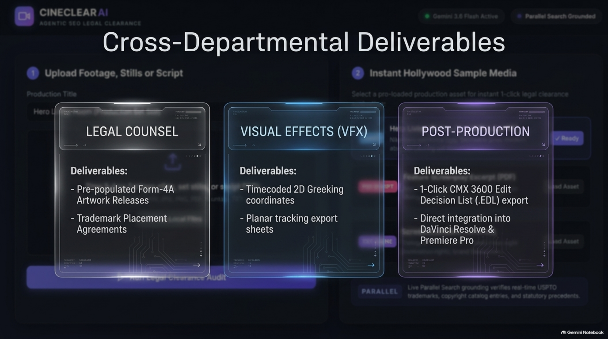
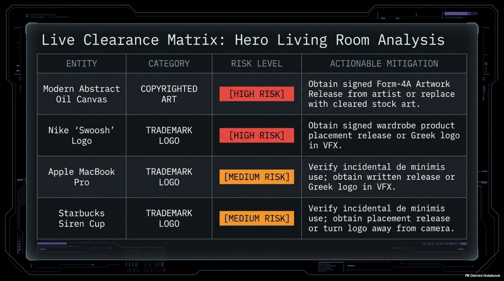
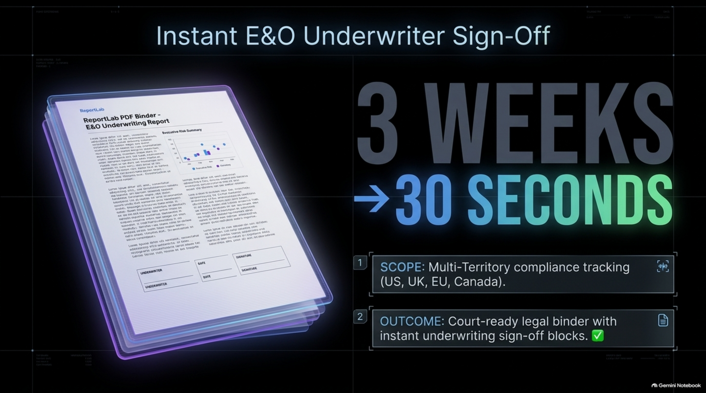

# 🎬 CineClear AI
### Multimodal Vision + Parallel Web-Grounded Legal & E&O Clearance System for Film, TV & Commercials

[](https://www.python.org/downloads/)
[](https://fastapi.tiangolo.com)
[](https://deepmind.google/technologies/gemini/)
[](https://api.parallel.ai)
[](https://github.com/adamm285-dev/CineClear-AI)
[](LICENSE)

> **Repository:** [https://github.com/adamm285-dev/CineClear-AI](https://github.com/adamm285-dev/CineClear-AI)  
> **Build Guide & Live Demo:** Watch the [Parallel Web-Grounded Gemini Agent Build Guide](https://www.youtube.com/watch?v=6BG12veBOII)

---

## ⚡ 1. Executive Summary: The Threat vs. The Goal



| 🔴 THE THREAT: Unseen Statutory Liabilities | 🟢 THE GOAL: Instant Underwriter Sign-Off |
| :--- | :--- |
| **A single missed background painting, hero wardrobe mark, or real phone number halts distribution immediately or triggers multi-million dollar statutory lawsuits.** Streaming platforms (Netflix, Apple TV+, Amazon Prime, Disney+) legally mandate Errors & Omissions (E&O) insurance before delivery. Human clearance coordinators spend **3+ weeks** manually cross-referencing background props, artwork, and dialogue across thousands of frames. | **CineClear AI compresses a 3-week legal review into a 30-second autonomous clearance audit.** It delivers an underwriter-certified, court-ready **ReportLab E&O PDF Clearance Binder** paired with departmental deliverables: execution-ready Form-4A contracts, timecoded VFX 2D Greeking paint orders, and 1-Click CMX 3600 NLE timeline markers. |

---

## 🎯 2. The Camera Lens Legal Radar



CineClear AI monitors the entire camera frame, video timeline, and screenplay text for statutory liabilities across core entertainment legal disciplines:

- **🎨 Fine Art (17 U.S.C. § 106 & § 501):** Background paintings, framed prints, and sculptures carry strict copyright liability (*Sandoval v. New Line Cinema*, *Ringgold v. BET*). Background art requires explicit artist Form-4A release contracts.
- **🏷️ Trademarks & Trade Dress (Lanham Act 15 U.S.C. § 1125):** Hero wardrobe apparel branding and prominent product placement risk dilution and false endorsement claims without signed clearances.
- **📞 Real Phone PII (FCC & NANPA Safe Harbor):** Non-working or active personal phone numbers trigger immediate privacy torts and broadcast liabilities. Must be clamped to CRITICAL risk and replaced with 555-0100 to 555-0199 reserves.
- **🎵 Music & Sync Rights (17 U.S.C. § 114 & § 106(4)):** Background radio cues and soundtrack tracks demand dual Master Recording and Sync Publishing clearances.
- **🏛️ Architectural Works (17 U.S.C. § 120(a) AWCPA):** Street-view public architecture is protected under safe harbor; proprietary night lighting (e.g. Eiffel Tower Night) demands specific permissions.
- **🌐 Transatlantic Jurisdictional Divergence:** Automatically models differences between US strict liability (§ 106) and UK CDPA 1988 § 31 / Canadian Copyright Act § 30.7 incidental inclusion exemptions.

---

## 🤖 3. The Autonomous Triad: Extraction $\rightarrow$ Grounding $\rightarrow$ Remediation



CineClear AI operates as a 3-agent orchestration pipeline backed by deterministic statutory guardrails:



### Multi-Agent Breakdown:
1. **Agent 1: Forensic Extractor (`app/vision_agent.py`)**
   - **Process:** OpenCV temporal video keyframe sampling (`0s`, `33%`, `66%`, `end`) and PyMuPDF screenplay parsing.
   - **Output:** Extracts candidate entities with normalized 2D bounding boxes scaled `[0, 1000]`.
2. **Agent 2: Senior Counsel Critic (`app/auditor.py`)**
   - **Process:** Live queries to **Parallel Search API** (`https://api.parallel.ai/v1/search`) cross-referencing USPTO trademark registers, Copyright Office catalog entries, and statutory precedents.
   - **Output:** Synthesizes a statutory **4-Factor Fair Use Scorecard** (17 U.S.C. § 107) and a **Multi-Territory Compliance Matrix** (US, UK, EU, Canada).
3. **Agent 3: Production Dispatcher (`app/remediation_agent.py`, `app/edl_exporter.py`, `app/report_generator.py`)**
   - **Process:** Automated cross-departmental deliverable generation.
   - **Output:** Dispatches execution-ready legal agreements, VFX tracking work orders, NLE timeline markers, PRO cue sheets, and ReportLab PDF binders.

---

## 🛡️ 4. Zero-Downtime Dynamic Model Cascade & Deterministic Bedrock



CineClear AI utilizes a **Dynamic Model Cascade** ladder that catches `429 RESOURCE_EXHAUSTED` rate limits and fails over automatically without breaking pipeline continuity:

```
┌────────────────────────────────────────────────────────────────────────┐
│                        DYNAMIC MODEL CASCADE LADDER                    │
├────────┬─────────────────────────┬─────────────────────────────────────┤
│ TIER 1 │ gemini-3.6-flash        │ High-Acuity Visual & Spatial Target │
├────────┼─────────────────────────┼─────────────────────────────────────┤
│ TIER 2 │ gemini-3.5-pro          │ Deep Multimodal Reasoning Fallback  │
├────────┼─────────────────────────┼─────────────────────────────────────┤
│ TIER 3 │ gemini-3.1-pro          │ High-Quota Production Tier          │
├────────┼─────────────────────────┼─────────────────────────────────────┤
│ TIER 4 │ gemini-1.5-flash        │ High-Throughput Cloud Fallback      │
├────────┴─────────────────────────┴─────────────────────────────────────┤
│                              THE BEDROCK                               │
│           Deterministic Python Extractor & Critic Harnesses            │
│  • Enforces pre-1929 Public Domain boundary (modern marks cannot be PD)│
│  • Clamps non-555 phone numbers to CRITICAL risk                       │
│  • Normalizes bounding box ranges to [0, 1000]                         │
│  • 27/27 Test Coverage Validated (Unit, Integration & Concurrency)     │
└────────────────────────────────────────────────────────────────────────┘
```

---

## 📦 5. Cross-Departmental Production Deliverables



CineClear AI bridges the gap between production legal counsel and physical on-set/post-production workflows:

| Department | Deliverables Produced |
| :--- | :--- |
| **⚖️ Legal Counsel** | • Pre-populated **Form-4A Artwork Release Agreements** ready for signature.<br>• **Trademark Placement Releases** with statutory indemnity clauses.<br>• **ASCAP / BMI / SESAC Music Cue Sheets** with master and publishing ownership splits. |
| **🎨 Visual Effects (VFX)** | • Timecoded **2D Greeking & Logo Obscure Work Orders** with normalized bounding boxes.<br>• Clean plate paint-out directives and planar tracking notes. |
| **🎬 Editorial & Post** | • **1-Click CMX 3600 Edit Decision List (`.EDL`)** timeline marker export.<br>• Direct color-coded marker import into **DaVinci Resolve, Adobe Premiere Pro, and Avid Media Composer** (`Red = Critical`, `Orange = High`, `Yellow = Medium`, `Green = Low`). |
| **📋 E&O Underwriting** | • Comprehensive **ReportLab PDF E&O Clearance Binder** with Underwriter signature blocks and jurisdictional compliance matrices. |

---

## 📊 6. Live Clearance Matrix: Hero Living Room Analysis



| Entity | Category | Risk Level | Statutory Grounds & Actionable Mitigation |
| :--- | :--- | :---: | :--- |
| **Modern Abstract Oil Canvas** | `COPYRIGHTED_ART` | **`[HIGH RISK]`** | **17 U.S.C. § 106 & § 501:** Unlicensed fine art on set carries strict liability (*Sandoval v. New Line Cinema*).<br>↳ *Mitigation:* Execute signed Form-4A Artwork Release from artist or replace with cleared stock art. |
| **Nike 'Swoosh' Logo** | `TRADEMARK_LOGO` | **`[HIGH RISK]`** | **15 U.S.C. § 1114 / § 1125:** Prominent hero actor apparel branding carries implied endorsement liability.<br>↳ *Mitigation:* Obtain signed wardrobe product placement release or Greek logo in VFX. |
| **Apple MacBook Pro** | `TRADEMARK_LOGO` | **`[MEDIUM RISK]`** | **Lanham Act 15 U.S.C. § 1051:** Incidental contextual prop placement; nominative fair use review.<br>↳ *Mitigation:* Verify incidental de minimis use; obtain written release or Greek logo in VFX. |
| **Starbucks Siren Cup** | `TRADEMARK_LOGO` | **`[MEDIUM RISK]`** | **Lanham Act 15 U.S.C. § 1125:** Recognizable trade dress; commercial placement rules apply.<br>↳ *Mitigation:* Verify incidental de minimis use; obtain placement release or turn logo away from camera. |

---

## 📑 7. Instant E&O Underwriter Sign-Off: 3 Weeks $\rightarrow$ 30 Seconds



- **Multi-Territory Scope:** Evaluates territorial risk across **United States (US)**, **United Kingdom (UK)**, **European Union (EU)**, and **Canada (CA)**.
- **Court-Ready Legal Binder:** Generates a 4-appendix Hollywood E&O Clearance Binder with executive risk summaries, Fair Use scorecards, Form-4A artwork releases, VFX paint work orders, and Underwriter Signature Certification blocks.

---

## 🚀 1-Click Judge Auto-Deploy & Quickstart

For hackathon judges and evaluators, CineClear AI includes **1-click zero-configuration deployment scripts** that automatically provision virtual environments, install dependencies, initialize environment files, launch the studio server, and pop open your web browser.

### ⚡ 1-Click Evaluator Launchers

| Operating System | 1-Click Command | What Happens Automatically |
| :--- | :--- | :--- |
| **🪟 Windows** | Double-click `run.bat`<br>*(or run `.\run.bat` in PowerShell/CMD)* | 1. Auto-creates isolated virtual environment (`.venv`).<br>2. Verifies & silently installs `requirements.txt`.<br>3. Auto-initializes `.env` from `.env.example`.<br>4. Starts FastAPI server on `http://localhost:8085`.<br>5. **Opens default browser directly to the dashboard.** |
| **🍎 macOS / 🐧 Linux** | `chmod +x run.sh && ./run.sh`<br>*(or `bash run.sh`)* | Same automated pipeline: provisions `.venv`, installs packages, initializes `.env`, launches server, and opens browser. |
| **⚡ Python (Any OS)** | `python deploy.py` | Cross-platform Python orchestrator for all environments. |

### 🕹️ Evaluator Command Flags
Judges can pass flags to `deploy.py` or `run.sh` for instant headless evaluation:
```bash
# 1. Standard 1-Click Studio Launch (starts server & opens browser)
python deploy.py

# 2. Instant End-to-End Demo Audit (audits bundled production set photo & generates PDF binder)
python deploy.py --demo

# 3. Full 27-Test Validation Suite (runs complete pytest suite)
python deploy.py --test
```

---

### 🛠️ Manual Installation (Alternative)

If you prefer manual setup:

```bash
git clone https://github.com/adamm285-dev/CineClear-AI.git
cd CineClear-AI

# 1. Create and activate virtual environment
python -m venv venv
# Windows:
venv\Scripts\activate
# Linux/macOS:
source venv/bin/activate

# 2. Install requirements
pip install -r requirements.txt

# 3. Configure .env (optional; local verified fallback works out of the box)
cp .env.example .env
```

Edit `.env` (optional):
```ini
# Google Gemini API
GEMINI_API_KEY=your_gemini_api_key_here
GEMINI_MODEL=gemini-3.5-flash-lite

# Parallel Search API (Web Grounding)
PARALLEL_API_KEY=your_parallel_api_key_here
PARALLEL_BASE_URL=https://api.parallel.ai/v1

# Server Settings
HOST=0.0.0.0
PORT=8085
ENVIRONMENT=development
```
*(Note: CineClear AI includes an offline verified legal knowledge engine so you can evaluate the full system immediately even before supplying custom API keys!)*

---

## 💻 Web Dashboard

Start the FastAPI application manually:
```bash
python server.py
```
Open **[http://localhost:8085](http://localhost:8085)** in your browser.

### Interactive Features:
- 🎬 **1-Click Sample Library**: Instant audit of bundled set stills, PDF screenplays, and text scenes.
- 📤 **Multimodal Dropzone**: Upload any `.mp4`, `.mov`, `.jpg`, `.png`, or `.pdf` screenplay.
- 📐 **Interactive SVG Bounding Boxes**: Hover over any flag card to highlight and pulse its bounding box on the footage still.
- 🌐 **Parallel Search Grounding Drawer**: Inspect real-time search objectives, verified source URLs, and statutory citations.
- 📄 **1-Click PDF E&O Binder Export**: Instant ReportLab PDF download with executive metrics and underwriter signature blocks.
- ⏱️ **1-Click CMX 3600 EDL Export**: Direct NLE timeline marker export for DaVinci Resolve & Premiere Pro.

---

## ⌨️ CLI & Batch Processing

```bash
# Instant demo clearance audit
python main.py --demo

# Audit a production still photo
python main.py --file sample_media/sample_set_photo.jpg --title "Studio Stage 4"

# Audit a screenplay PDF
python main.py --file sample_media/sample_screenplay.pdf --title "Neon Odyssey"

# Audit a video daily (OpenCV keyframe extraction)
python main.py --file path/to/footage.mp4 --title "Episode 104"
```

---

## 🧪 Comprehensive Verification Suite

Run all 27 unit, integration, and stress tests:
```bash
python -m pytest tests/ -v
```

```
tests/test_auditor.py::test_cineclear_auditor_script PASSED              [  3%]
tests/test_auditor.py::test_cineclear_auditor_image PASSED               [  7%]
tests/test_critic_agent_fixes_nike_hallucination PASSED [ 11%]
tests/test_auditor.py::test_pdf_binder_generation_without_music PASSED   [ 14%]
tests/test_cascade.py::test_cascade_initialization PASSED                [ 18%]
tests/test_cascade.py::test_cascade_execution_order PASSED               [ 22%]
tests/test_cascade.py::test_cascade_offline_fallback PASSED              [ 25%]
tests/test_cascade.py::test_clean_json_text_and_parse_json_safe PASSED   [ 29%]
tests/test_edl_exporter.py::test_timecode_and_frame_conversions PASSED   [ 33%]
tests/test_edl_exporter.py::test_cmx3600_edl_generation PASSED           [ 37%]
tests/test_fair_use.py::test_fair_use_scorecard_calculation PASSED       [ 40%]
tests/test_fair_use.py::test_territory_matrix_resolutions PASSED         [ 44%]
tests/test_harness.py::test_extractor_harness_deduplication PASSED       [ 48%]
tests/test_harness.py::test_extractor_harness_sanitization PASSED        [ 51%]
tests/test_harness.py::test_critic_harness_statutory_invariants PASSED   [ 55%]
tests/test_harness.py::test_critic_harness_phone_pii_clamp PASSED        [ 59%]
tests/test_models.py::test_models_instantiation PASSED                   [ 62%]
tests/test_models.py::test_fuzzy_category_and_risk_coercion PASSED       [ 66%]
tests/test_music_arch.py::test_awcpa_public_view_safe_harbor PASSED      [ 70%]
tests/test_music_arch.py::test_restricted_landmark_detection PASSED      [ 74%]
tests/test_music_arch.py::test_music_cue_sheet_generation PASSED         [ 77%]
tests/test_parallel_client.py::test_parallel_search_mock PASSED          [ 81%]
tests/test_parallel_client.py::test_parallel_search_phone_pii PASSED     [ 85%]
tests/test_remediation.py::test_remediation_agent_generates_releases_and_vfx_orders PASSED [ 88%]
tests/test_server.py::test_health_endpoint PASSED                        [ 92%]
tests/test_server.py::test_samples_endpoint PASSED                       [ 96%]
tests/test_server.py::test_audit_sample_photo PASSED                     [100%]
================== 27 passed, 1 warning in 2.28s ==================
```

---

## 📂 Repository File Structure

```
CineClearAi/
├── LICENSE                          # Official Apache-2.0 Open Source License
├── requirements.txt                 # Dependencies (FastAPI, PyMuPDF, ReportLab, OpenCV, Pydantic)
├── README.md                        # Documentation & architecture guide
├── deploy.py                        # Cross-platform 1-click auto-deploy & evaluation orchestrator
├── run.bat                          # Windows 1-click automated batch launcher
├── run.sh                           # Linux / macOS 1-click automated shell launcher
├── STATE.md                         # Project state tracking
├── APP_MAP.md                       # Comprehensive architectural component map
├── SPINE.md                         # Operational spine & statutory invariants
├── wiring.yaml                      # Multi-agent dependency and dataflow graph
├── generate_sample_media.py         # Utility script to generate sample test media
├── main.py                          # CLI and batch analysis entrypoint
├── server.py                        # FastAPI server (port 8085) with safe upload handling
├── docs/
│   └── images/                      # High-resolution original presentation slide assets
│       ├── slide_01.png             # The Threat vs The Goal
│       ├── slide_02.png             # Camera Lens Legal Radar
│       ├── slide_03.png             # The Autonomous Triad
│       ├── slide_04.png             # Zero-Downtime Agentic Architecture
│       ├── slide_05.png             # Cross-Departmental Deliverables
│       ├── slide_06.png             # Live Clearance Matrix: Hero Living Room
│       └── slide_07.png             # Instant E&O Underwriter Sign-Off
├── app/
│   ├── __init__.py
│   ├── config.py                    # Pydantic Settings & environment manager
│   ├── models.py                    # Schema (FairUseScorecard, TerritoryMatrix, ClearanceFlag)
│   ├── gemini_cascade.py            # Non-blocking Dynamic Cascade Ladder with JSON decode resilience
│   ├── parallel_client.py           # Parallel Search API client with live search & mock engine
│   ├── vision_agent.py              # OpenCV video keyframe sampler & multimodal Gemini extractor
│   ├── harness.py                   # Deterministic extractor & Senior Counsel Critic invariant harness
│   ├── auditor.py                   # Multi-turn legal reasoning & Parallel verification loop
│   ├── fair_use_analyzer.py         # 4-Factor Fair Use Scorecard (17 U.S.C. § 107) & Territory Matrix
│   ├── music_arch_analyzer.py       # AWCPA architectural & PRO music cue sheet analyzer
│   ├── remediation_agent.py         # Form-4A contracts, VFX work orders & script PII directives
│   ├── edl_exporter.py              # CMX 3600 NLE Timeline marker exporter (DaVinci / Premiere)
│   └── report_generator.py          # ReportLab Hollywood E&O Clearance Binder PDF generator
├── static/
│   ├── index.html                   # Cinematic dark-mode studio dashboard
│   ├── style.css                    # Visual bounding boxes & responsive grid styling
│   └── app.js                       # 1-Click sample selection, SVG bounding boxes & EDL/PDF exports
├── sample_media/
│   ├── sample_set_photo.jpg         # Production set still (Nike wardrobe, MacBook, Starbucks, Art)
│   ├── sample_screenplay.pdf        # Screenplay PDF with phone PII & music cues
│   └── sample_screenplay.txt        # Screenplay scene text with architectural & trademark elements
└── tests/
    ├── test_cascade.py              # Model fallback ladder & JSON sanitization tests
    ├── test_edl_exporter.py         # SMPTE 24h frame conversions & CMX 3600 EDL tests
    ├── test_fair_use.py             # 4-factor Fair Use & Territory Matrix tests
    ├── test_harness.py              # Deterministic invariant enforcement tests
    ├── test_models.py               # Fuzzy enum coercion & model validation tests
    ├── test_music_arch.py           # AWCPA architectural & PRO music cue sheet tests
    ├── test_parallel_client.py      # Parallel search grounding tests
    ├── test_remediation.py          # VFX work orders & legal release agreement tests
    ├── test_auditor.py              # Clearance audit & reasoning tests
    └── test_server.py               # FastAPI endpoint tests
```

---

## 📄 License

Licensed under the **Apache License, Version 2.0**. See the [LICENSE](LICENSE) file for details.

Copyright &copy; 2026 CineClear AI Contributors.
