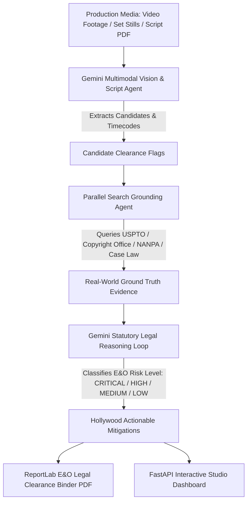

# 🎬 CineClear AI
### Multimodal Vision + Parallel Web-Grounded Legal & E&O Clearance System for Film, TV & Commercials

[](https://www.python.org/downloads/)
[](https://fastapi.tiangolo.com)
[](https://deepmind.google/technologies/gemini/)
[](https://api.parallel.ai)
[](https://opensource.org/licenses/MIT)

> **Repository:** [https://github.com/adamm285-dev/CineClear-AI](https://github.com/adamm285-dev/CineClear-AI)  
> **Build Guide & Live Tool Evaluation:** Watch the [Parallel Web-Grounded Gemini Agent Build Guide](https://www.youtube.com/watch?v=6BG12veBOII)

---

## 📌 Overview

**CineClear AI** is an autonomous agentic legal clearance and E&O (Errors & Omissions) insurance risk intelligence platform for Hollywood studios, production companies, and commercial directors. 

Pre-distribution legal clearance in entertainment is traditionally a manual, multi-week process costing upwards of \$50,000 per feature film. CineClear AI automates this workflow by pairing **Google Gemini Multimodal Vision & Audio Analysis** with **Parallel Search Web Grounding** to detect, research, and mitigate intellectual property and privacy liabilities before footage is locked.

---

## 🏛 Architecture & Agentic Workflow



### 1. Multimodal Asset Parsing (`app/vision_agent.py`)
- **Still Stills & Set Photos**: Detects background artwork, hero props, branded wardrobe, and visible documents.
- **Video Footage Keyframes**: Temporal sampling across shots via OpenCV to catch fleeting brand placements.
- **Screenplay Documents (PDF/TXT)**: Parses dialogue, scene headings, and action lines for real phone numbers, living celebrity mentions, and commercial music cues.

### 2. Live Web Grounding (`app/parallel_client.py`)
- Executes semantic objective queries against **Parallel Search API** (`https://api.parallel.ai/v1/search`).
- Investigates active **USPTO Trademark Registrations**, **US Copyright Office Catalog Entries**, **Public Domain Expiration Rules (pre-1929)**, and **NANPA 555 Fictional Number Reserves**.

### 3. Statutory Legal Reasoning (`app/auditor.py`)
- Synthesizes findings under:
  - **Lanham Act (15 U.S.C. § 1114/1125)**: Trademark infringement, trade dress & false endorsement.
  - **17 U.S.C. § 106 & § 107**: Reproduction rights and fair use / *de minimis* standards (*Sandoval v. New Line Cinema*).
  - **17 U.S.C. § 120(a)**: Architectural Works Copyright Protection Act (AWCPA) safe harbors.
  - **NANPA / FCC Standards**: Strict liability for non-555 phone number broadcasts.

### 4. Hollywood E&O Insurance Binder (`app/report_generator.py`)
- Generates a multi-page **ReportLab PDF Legal Clearance Binder** complete with:
  - Executive Risk Matrix (Critical, High, Medium, Low breakdown)
  - Itemized Clearance Ledger
  - Deep-Dive Flag Dossiers with search objectives, sources, and statutory citations
  - Production Counsel & E&O Underwriter Signature Certification blocks.

---

## ⚖️ 6 Core Clearance Liability Categories

| Category | Description | Common Risk Level | Typical Mitigation |
| :--- | :--- | :---: | :--- |
| **`TRADEMARK_LOGO`** | Brand logos on wardrobe, electronics, beverage cans, storefronts | **MEDIUM / CRITICAL** | VFX Greeking / De-badging or Product Placement Release |
| **`COPYRIGHTED_ART`** | Modern paintings, sculptures, graffiti, posters in background | **HIGH** | Form-4A Artwork Release Form or stock replacement |
| **`ARCHITECTURAL_RIGHTS`** | Buildings with proprietary lighting installations (e.g. Eiffel Tower Night) | **HIGH / LOW** | License night lighting from SETÉ or daytime shot |
| **`MUSIC_AUDIO`** | Commercial radio songs, background tracks, score cues | **HIGH** | Master Sync + Mechanical Publishing Licenses |
| **`PHONE_PII`** | Real telephone numbers outside 555-0100 to 555-0199 range | **CRITICAL** | VFX screen replacement & ADR dialogue rerecording |
| **`NAME_DEFAMATION`** | Real entities portrayed in criminal or disparaging contexts | **CRITICAL** | Script supervisor vetted corporate alias replacement |

---

## 🚀 Quickstart & Installation

### 1. Clone Repository & Setup Environment
```bash
git clone https://github.com/adamm285-dev/CineClear-AI.git
cd CineClear-AI

# Create virtual environment (optional)
python -m venv venv
# On Windows:
venv\Scripts\activate
# On Linux/macOS:
source venv/bin/activate

# Install dependencies
pip install -r requirements.txt
```

### 2. Configure API Keys (`.env`)
Copy `.env.example` to `.env` and add your API keys:
```bash
cp .env.example .env
```
Edit `.env`:
```ini
# Google Gemini
GEMINI_API_KEY=your_gemini_api_key_here
GEMINI_MODEL=gemini-2.5-pro

# Parallel Search API
PARALLEL_API_KEY=your_parallel_api_key_here
PARALLEL_BASE_URL=https://api.parallel.ai/v1

# Server
HOST=0.0.0.0
PORT=8085
ENVIRONMENT=development
```
*(Note: CineClear AI includes an offline verified legal knowledge engine so you can test immediately even before setting custom keys!)*

---

## 💻 Web Dashboard

Start the FastAPI server:
```bash
python server.py
```
Open your browser at **[http://localhost:8085](http://localhost:8085)**.

### Dashboard Features:
- 🎬 **Instant Sample Media**: 1-click evaluation of bundled set stills and screenplay PDFs.
- 📤 **Drag-and-Drop Media Dropzone**: Upload any video, photo, or script file.
- ⚡ **Live Pipeline Progress Animation**: Real-time visualization of Multimodal Parsing, Parallel Grounding, and Statutory Synthesis.
- 🔍 **Interactive Risk Filter Tabs**: Filter flags by `CRITICAL`, `HIGH`, `MEDIUM`, or `LOW`.
- 🌐 **Parallel Grounding Drawer**: Inspect search objectives, source links, and statutory citations for every flag.
- 📄 **1-Click PDF Export**: Download Hollywood-grade E&O Clearance Binder PDF.

---

## ⌨️ CLI & Batch Processing

You can also run legal audits directly from your terminal:

```bash
# Run instant demo audit
python main.py --demo

# Audit a production still photo
python main.py --file sample_media/sample_set_photo.jpg --title "Studio Stage 4"

# Audit a screenplay PDF
python main.py --file sample_media/sample_screenplay.pdf --title "Midnight Drive" --output-json report.json

# Audit a video file
python main.py --file path/to/footage.mp4 --title "Episode 104"
```

---

## 🧪 Testing

Run the automated test suite:
```bash
python -m pytest tests/ -v
```

---

## 📂 Project Structure

```
cineclear-ai/
├── .env.example                     # Environment template
├── requirements.txt                 # Project dependencies
├── README.md                        # Documentation & guides
├── main.py                          # CLI entrypoint
├── server.py                        # FastAPI web server & dashboard API
├── app/
│   ├── __init__.py
│   ├── config.py                    # Environment settings & validation
│   ├── models.py                    # Pydantic schemas (RiskLevel, ClearanceFlag, etc.)
│   ├── parallel_client.py           # Parallel Search API client & web grounding
│   ├── vision_agent.py              # Gemini Multimodal visual & audio parser
│   ├── auditor.py                   # Multi-turn legal reasoning & verification loop
│   └── report_generator.py          # ReportLab PDF E&O Clearance Binder generator
├── static/
│   ├── index.html                   # Hollywood dark-mode dashboard
│   ├── style.css                    # Cinematic styles & animations
│   └── app.js                       # Interactive frontend logic & PDF download
├── sample_media/                    # Preloaded test assets
│   ├── sample_set_photo.jpg         # Sample production still
│   ├── sample_screenplay.pdf        # Screenplay PDF with PII/brands
│   └── sample_screenplay.txt        # Screenplay scene text
└── tests/                           # Test suite
    ├── test_models.py
    ├── test_parallel_client.py
    ├── test_auditor.py
    └── test_server.py
```

---

## 📄 License

MIT License. Copyright &copy; 2026 CineClear AI Contributors.
